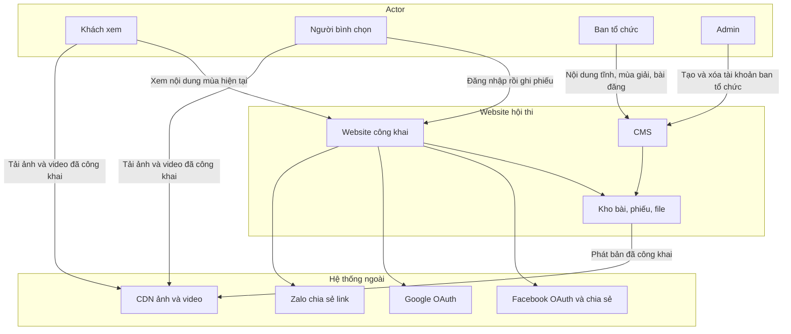
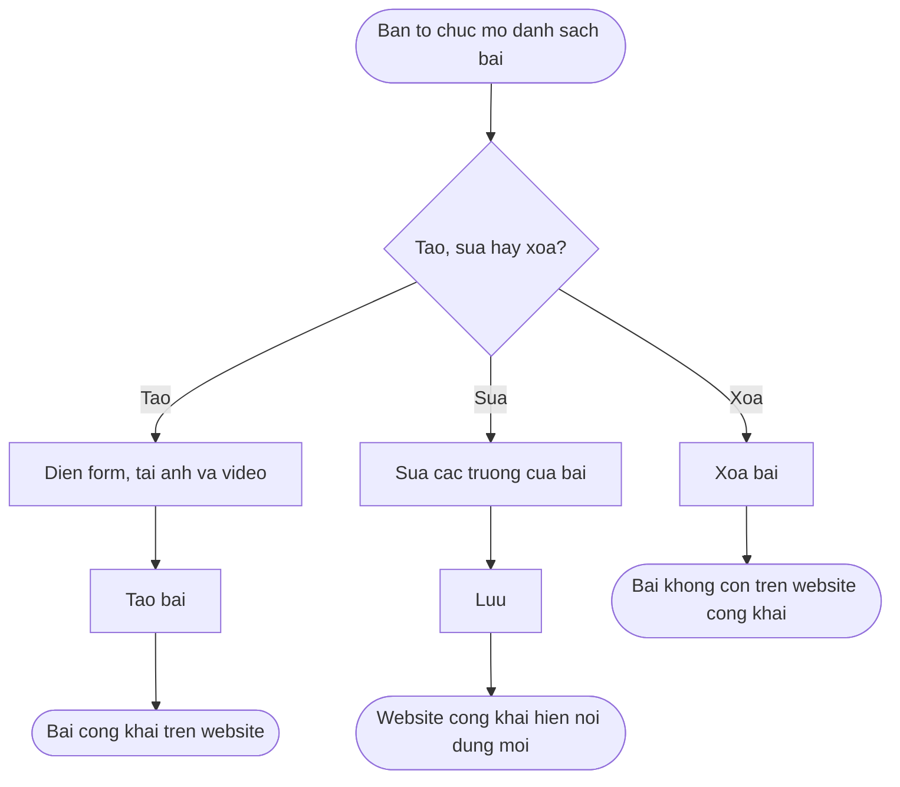
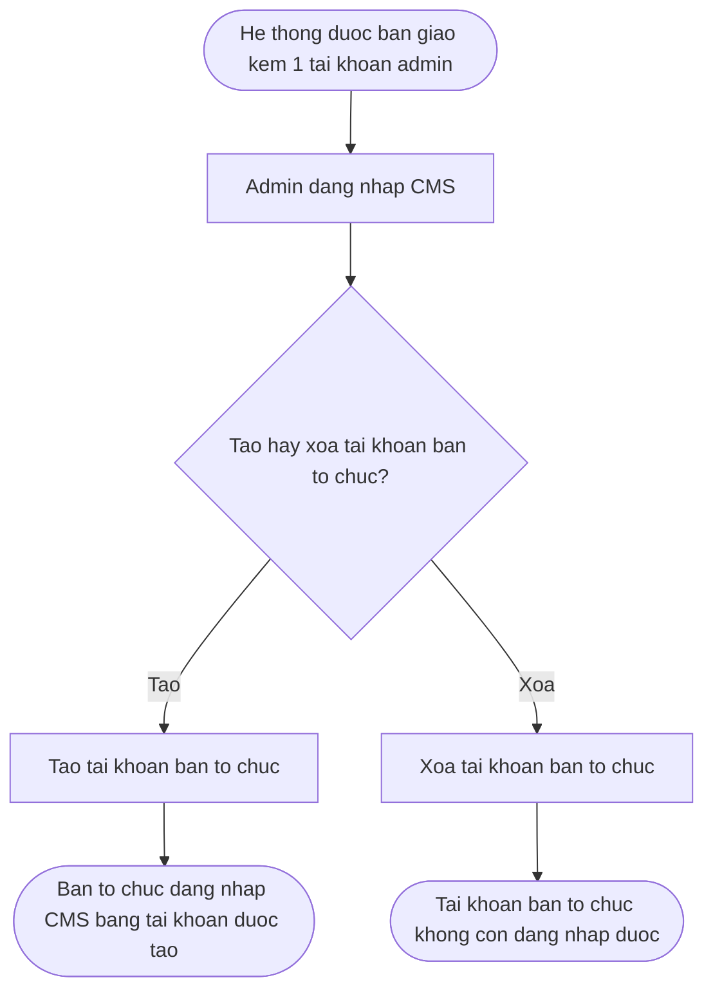
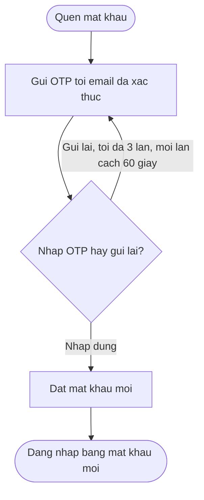

## 2. Overall Description

> Sơ bản 0.1. Đọc cùng `docs/srs/1-introduction.md`. Hành vi gắn với **[GIẢ ĐỊNH]** hoặc **[MỞ]** chưa phải yêu cầu đã chốt.

### 2.1 Product Perspective

**Product Context:**

Sản phẩm mới, xây cho mùa thi đầu tiên có website. Các năm sau dùng cùng hệ thống, dữ liệu tách theo mùa. Hệ thống không thay một website cuộc thi đang chạy, và không phải module của một nền tảng đa cuộc thi.

**System Relationships:**

Người dùng chỉ làm việc trên trình duyệt. Website công khai và CMS là hai bề mặt. Ban tổ chức nhận hồ sơ điểm đến ngoài website, rồi đăng nhập CMS bằng tài khoản được cấp để đăng bài. Không có luồng tự đăng ký CMS. **[GIẢ ĐỊNH]** Một tài khoản admin được bàn giao cùng hệ thống và không tạo được trên CMS; admin tạo và xóa tài khoản ban tổ chức (ASM-09). Khách xem và người bình chọn dùng website công khai. Việc bài công khai ngay khi tạo nằm trong giả định quản lý bài đăng, chờ chốt spec (ASM-01). Ảnh và video do ban tổ chức tải lên kho file của hệ thống. **[ĐỀ XUẤT]** Bản đã công khai được phát qua CDN để trang danh sách và trang chi tiết preload ảnh, video từ CDN thay vì từ máy chủ ứng dụng. Người bình chọn phụ thuộc đăng nhập Facebook và Google. Khi người dùng chọn Facebook hoặc Zalo, hệ thống mở chức năng chia sẻ tương ứng và truyền URL bài viết vào nội dung chia sẻ. TikTok dùng cùng URL đó làm link in bio; hệ thống không đăng video gốc lên TikTok.

Tên miền do Bộ Nông nghiệp và Môi trường đăng ký và bàn giao. Sơ bản chưa ghi tên miền cụ thể.

**Context Diagram:**

Bốn actor dưới đây trùng với mục 2.2. Khách xem và người bình chọn chỉ dùng website công khai. Admin và ban tổ chức chỉ dùng CMS. Facebook, Google, Zalo và CDN là hệ thống ngoài.

Admin trên sơ đồ là giả định ASM-09: một tài khoản được bàn giao, dùng để tạo và xóa tài khoản ban tổ chức. Bài đăng của ban tổ chức vẫn chờ chốt spec (ASM-01).

### 2.2 User Classes and Characteristics

| User Class      | Description                                                                             | Characteristics                                                                                                                                  | Priority |
| --------------- | --------------------------------------------------------------------------------------- | ------------------------------------------------------------------------------------------------------------------------------------------------ | -------- |
| Khách xem       | Xem thể lệ, tin, hội đồng, danh sách bài và số phiếu của mùa hiện tại                   | Không cần đăng nhập. Dùng điện thoại hoặc máy tính, tiếng Việt                                                                                   | Primary  |
| Người bình chọn | Đăng nhập Facebook hoặc Google rồi ghi phiếu                                            | Một tài khoản mạng xã hội là một tư cách bình chọn trong mùa. Quyền phiếu không sang mùa sau                                                     | Primary  |
| Admin           | Tạo và xóa tài khoản ban tổ chức trên CMS                                               | Đúng một tài khoản, được cung cấp khi bàn giao, không tạo được trên hệ thống **[GIẢ ĐỊNH]** (ASM-09)                                             | Primary  |
| Ban tổ chức     | Nội dung tĩnh, mùa giải và thời gian bình chọn trên CMS. Quản lý bài đăng chờ chốt spec | Đăng nhập bằng tài khoản do admin tạo. Không tự đăng ký. Không chấm điểm trên hệ thống. **[GIẢ ĐỊNH], chờ chốt spec:** quản lý bài đăng (ASM-01) | Primary  |

### 2.3 Operating Environment

**Hardware Platform:**

- Máy chủ ứng dụng, cơ sở dữ liệu và kho file đặt tại Việt Nam **[GIẢ ĐỊNH]**
- Quy mô thiết kế: khoảng 100 lượt truy cập đồng thời ở giai đoạn cao điểm
- Kho file phải chứa ảnh và video của khoảng 68 bài ở mùa đầu, và bài của những mùa sau trên cùng hệ thống

**Operating Systems:**

- Trình duyệt Chrome, Safari, Edge bản hiện hành trên máy tính và điện thoại
- Không có ứng dụng cài đặt riêng

**Software Components:**

- Website công khai tiếng Việt
- CMS để đăng nhập, cập nhật nội dung tĩnh, tạo và xóa tài khoản ban tổ chức, quản lý mùa giải và thời gian mở, đóng bình chọn. Quản lý bài đăng là giả định chờ chốt spec (ASM-01)
- Cơ sở dữ liệu tách theo mùa giải
- Kho lưu ảnh và video
- **[ĐỀ XUẤT]** CDN phát ảnh và video đã công khai, để giao diện preload các file này
- Đăng nhập OAuth với Facebook và Google cho người bình chọn

Ngôn ngữ lập trình, framework và nhà cung cấp máy chủ chưa bị ràng buộc, miễn đáp ứng các mục trên và ngân sách.

### 2.4 Design and Implementation Constraints

**Technology Constraints:**

- **Programming Languages:** chưa chỉ định
- **Databases:** dữ liệu bài thi, phiếu và tài khoản bình chọn phải tách được theo mùa
- **Frameworks:** chưa chỉ định
- **Xác thực bình chọn:** Facebook hoặc Google. Một tài khoản ghi tối đa một phiếu cho cùng một bài trong một mùa
- **Xác thực CMS [GIẢ ĐỊNH]:** đăng nhập bằng tài khoản được cấp. Không tự đăng ký. Đúng một tài khoản admin được bàn giao; admin tạo và xóa tài khoản ban tổ chức. Tài khoản admin không tạo thêm được trên hệ thống. **[ĐỀ XUẤT]** gắn email, xác thực OTP và quên mật khẩu ở mục 2.7
- **Hiển thị phiếu [ĐỀ XUẤT], gắn OPEN-03:** khách xem, người bình chọn và ban tổ chức chỉ thấy số lượng phiếu. Không tra cứu được danh tính người đã vote. **[ĐỀ XUẤT]** CMS có màn thống kê số phiếu từng bài, lọc theo mùa giải (mục 2.8); màn này cũng chỉ hiện số lượng, không hiện người đã vote
- **Công khai số phiếu theo thời gian thực [ĐỀ XUẤT]:** số trên danh sách và trang chi tiết là tổng phiếu đang lưu ở hệ thống. Khi một phiếu được ghi nhận, màn hình lấy lại tổng đó và thay số đang hiện. Giao diện không tính bằng số đang hiện cộng 1, để nhiều phiếu xảy ra cùng lúc vẫn ra đúng tổng mới nhất
- **File:** ảnh và video lưu trên hệ thống, không chỉ nhúng liên kết ngoài
- **CDN [ĐỀ XUẤT]:** khi ban tổ chức đăng bài, ảnh và video được đưa lên CDN. Trang danh sách và trang chi tiết preload media từ CDN. Máy chủ ứng dụng không phát trực tiếp các file này cho khách xem
- **Ngôn ngữ giao diện:** tiếng Việt
- **Tải đồng thời:** khoảng 100 phiên

**Corporate/Regulatory Policies:**

- Dữ liệu nhận từ mạng xã hội chỉ phục vụ vận hành cuộc thi; dữ liệu tách theo mùa
- Tên miền do Bộ tự đăng ký
- Chưa có kế hoạch hợp đồng bảo trì sau mùa giải

### 2.5 Assumptions and Dependencies

**Assumptions:**

| ID     | Nội dung                                                                                                                                                                                                                                                                                        |
| ------ | ----------------------------------------------------------------------------------------------------------------------------------------------------------------------------------------------------------------------------------------------------------------------------------------------- |
| ASM-01 | **Chờ chốt spec.** Ban tổ chức quản lý bài của mùa trên CMS: xem danh sách, tạo, sửa, xóa. Bài công khai ngay khi tạo; không có nháp hay chờ duyệt. Sửa thì website công khai hiện nội dung mới. Xóa thì bài không còn trên website công khai. Trường của form tạo và sửa là đề xuất ở mục 2.6. |
| ASM-03 | Nhiều tài khoản mạng xã hội của cùng một người là nhiều tư cách bình chọn. Sơ bản không thêm giới hạn theo IP hoặc thiết bị.                                                                                                                                                                    |
| ASM-04 | Máy chủ và kho file đặt tại Việt Nam.                                                                                                                                                                                                                                                           |
| ASM-05 | Mùa đầu khoảng 68 bài, 34 tỉnh thành. Con số này là quy mô dự kiến, không phải trần cứng của phần mềm.                                                                                                                                                                                          |
| ASM-06 | Cùng một người dùng Facebook năm sau vẫn đăng nhập được, nhưng phiếu và quyền bình chọn thuộc về từng mùa, không mang sang năm sau.                                                                                                                                                             |
| ASM-07 | Trang giới thiệu, thể lệ, tin tức và hội đồng ban giám khảo là nội dung tĩnh do ban tổ chức cung cấp, cập nhật qua CMS.                                                                                                                                                                         |
| ASM-08 | Khi người dùng chọn Facebook hoặc Zalo, hệ thống mở chức năng chia sẻ tương ứng và truyền URL bài viết vào nội dung chia sẻ. TikTok dùng cùng URL đó làm link in bio; hệ thống không đăng video gốc lên TikTok.                                                                                 |
| ASM-09 | CMS không có luồng tự đăng ký. Có đúng một tài khoản admin được cung cấp khi bàn giao và không tạo được trên hệ thống. Admin đăng nhập CMS rồi tạo hoặc xóa tài khoản ban tổ chức. Tài khoản ban tổ chức do admin tạo dùng để đăng nhập CMS.                                                    |
| ASM-10 | Trên trang chi tiết bài dự thi, nếu bài có 1 video thì video đó tự động phát.                                                                                                                                                                                                                   |
| ASM-11 | Danh sách bài dự thi lọc được theo tỉnh thành. Tỉnh thành lấy từ trường tỉnh/thành của bài đã công khai.                                                                                                                                                                                        |
| ASM-12 | Ban tổ chức quản lý mùa giải trên CMS và đặt thời gian mở bình chọn cùng thời gian đóng bình chọn của mùa. Website công khai chỉ nhận phiếu trong khoảng thời gian đó.                                                                                                                          |

**Điểm còn mở:**

| ID      | Câu hỏi                                                                             | Cách sơ bản đang xử lý                                                                                                                                                                                                                           |
| ------- | ----------------------------------------------------------------------------------- | ------------------------------------------------------------------------------------------------------------------------------------------------------------------------------------------------------------------------------------------------ |
| OPEN-01 | Người đã vote một bài có được bỏ phiếu đó không?                                    | Sơ bản chỉ chốt việc chặn phiếu thứ hai trên cùng bài. Chưa có bước bỏ phiếu.                                                                                                                                                                    |
| OPEN-02 | Sơ khảo và chung kết được tách trên website thế nào, và bình chọn gắn với vòng nào? | Chưa vẽ luồng theo vòng. Bình chọn được mô tả là một đợt trong mùa hiện tại. Thời gian mở và đóng do ban tổ chức đặt trên mùa giải (ASM-12). Mốc đầu tháng 11 và đầu tháng 12 là lịch dự kiến của mùa đầu, chưa gán lên từng màn hình theo vòng. |
| OPEN-03 | Có xem được ai đã vote cho một bài thi không?                                       | **[ĐỀ XUẤT]** Mọi vai trò chỉ thấy số lượng phiếu của bài. Không có màn hình danh sách người đã vote, kể cả ban tổ chức. Hệ thống vẫn lưu phiếu theo tài khoản để chặn vote trùng trên cùng một bài.                                             |

**Dependencies:**

- Bộ bàn giao tên miền trước khi phát hành công khai
- Tài khoản admin CMS được cấp cùng bản bàn giao; không có cách tự tạo tài khoản này trên hệ thống
- Ứng dụng Facebook và ứng dụng Google OAuth được duyệt đúng hạn, vì đăng nhập bình chọn phụ thuộc hai bên này
- Ban tổ chức cung cấp thể lệ, giới thiệu, tin tức, danh sách hội đồng ban giám khảo và hồ sơ các bài cần đăng
- Hạn mức dung lượng và thời lượng video chưa chốt; cần chốt trước khi ước lượng kho file và băng thông CDN trong ngân sách 50–60 triệu đồng
- **[ĐỀ XUẤT]** Form tạo và sửa bài đăng trên CMS cần được chấp thuận trước khi đưa vào phạm vi xây dựng
- **[ĐỀ XUẤT]** Gắn email, xác thực OTP và quên mật khẩu trên CMS cần được chấp thuận trước khi đưa vào phạm vi xây dựng. SMS OTP vẫn ngoài phạm vi
- **[ĐỀ XUẤT]** Thống kê số phiếu từng bài trên CMS, lọc theo mùa giải, cần được chấp thuận trước khi đưa vào phạm vi xây dựng
- **[ĐỀ XUẤT]** CDN cho ảnh và video công khai cần được chấp thuận trước khi đưa vào phạm vi xây dựng

### 2.6 Quản lý bài đăng trên CMS

Mục này là chi tiết của ASM-01, **[GIẢ ĐỊNH], chờ chốt spec**.

Ban tổ chức nhận hồ sơ từ các tỉnh thành ngoài website, rồi quản lý bài của mùa trên CMS. Màn hình quản lý có danh sách bài và ba thao tác: tạo, sửa, xóa.

Tạo bài dùng form bên dưới. Bài xuất hiện trên website ngay khi tạo. Sửa bài mở lại cùng các trường đó; sau khi lưu, website công khai hiện nội dung mới. Xóa bài gỡ bài khỏi danh sách và trang chi tiết trên website công khai.

CMS không có trạng thái nháp hoặc chờ duyệt. Hàng đợi duyệt bài nằm ngoài phạm vi. Bài còn trong danh sách quản lý là bài đang công khai.

#### Trường form tạo và sửa bài **[ĐỀ XUẤT]**

Đề xuất cho form tạo bài và form sửa bài trên CMS của ban tổ chức. Hai form dùng cùng các trường. Chưa phải yêu cầu bắt buộc cho đến khi được chấp thuận.

Mùa giải do hệ thống gán vào mùa mà ban tổ chức đang quản lý. Thời gian mở và đóng bình chọn của mùa do ban tổ chức đặt (ASM-12). Mùa giải không phải trường trên form.

| Trường                  | Bắt buộc                         | Hiển thị                                                                                |
| ----------------------- | -------------------------------- | --------------------------------------------------------------------------------------- |
| Tên điểm đến            | Có                               | Công khai khi đăng                                                                      |
| Tỉnh/thành              | Có, chọn trong danh sách         | Công khai khi đăng                                                                      |
| Xã/phường và huyện/quận | Có                               | Công khai khi đăng                                                                      |
| Mô tả điểm đến          | Có, tối đa 2.000 ký tự           | Công khai khi đăng                                                                      |
| Ảnh                     | Có, từ 1 đến 10 ảnh              | Công khai khi đăng                                                                      |
| Video                   | Có, đúng 1 file tải lên hệ thống | Công khai khi đăng. **[GIẢ ĐỊNH]** Trên trang chi tiết, video này tự động phát (ASM-10) |

Dung lượng mỗi ảnh, dung lượng và thời lượng video vẫn là phụ thuộc chưa chốt ở mục Dependencies.

### 2.7 Tài khoản CMS

CMS không có màn hình tự đăng ký. Người dùng CMS đăng nhập bằng tài khoản đã có.

**[GIẢ ĐỊNH]** Khi bàn giao có đúng một tài khoản admin. Tài khoản này không tạo được trên CMS, kể cả bởi chính admin. Admin đăng nhập rồi tạo hoặc xóa tài khoản ban tổ chức. Sơ bản chỉ gồm hai thao tác đó với tài khoản ban tổ chức; chưa mô tả sửa tài khoản. Quên mật khẩu là đề xuất bên dưới.

Tài khoản ban tổ chức dùng cho luồng đăng bài ở mục 2.6 và cập nhật nội dung tĩnh. Tài khoản admin không nằm trong nhóm tài khoản mà admin được tạo hoặc xóa.

#### Email và quên mật khẩu **[ĐỀ XUẤT]**

Đề xuất cho tài khoản CMS của ban tổ chức, gồm tài khoản admin. Chưa phải yêu cầu bắt buộc cho đến khi được chấp thuận. Không áp dụng cho người bình chọn. SMS OTP vẫn ngoài phạm vi.

Mỗi tài khoản CMS gắn với một email. Email phải được xác thực bằng OTP gửi tới địa chỉ đó thì mới dùng cho quên mật khẩu.

Quên mật khẩu chỉ gửi OTP tới email đã xác thực của tài khoản. Người dùng nhập OTP để đặt mật khẩu mới.

Với mỗi lượt xác thực email hoặc quên mật khẩu, hệ thống gửi OTP lần đầu, rồi cho gửi lại tối đa 3 lần. Mỗi lần gửi lại cách lần gửi ngay trước đó 60 giây. Hết 3 lần gửi lại thì không gửi thêm trong lượt đó.

### 2.8 Thống kê phiếu trên CMS **[ĐỀ XUẤT]**

Đề xuất cho website CMS của ban tổ chức. Chưa phải yêu cầu bắt buộc cho đến khi được chấp thuận. Website công khai không có màn này.

CMS có màn thống kê số phiếu của từng bài đăng. Ban tổ chức lọc theo mùa giải; danh sách chỉ còn bài của mùa được chọn.

#### Trường thông tin **[ĐỀ XUẤT]**

Bộ lọc và các cột lấy từ dữ liệu bài đã có. Màn này không hiện mô tả, ảnh, video, và không hiện người đã vote.

| Trường                      | Vai trò                         | Nguồn                                      |
| --------------------------- | ------------------------------- | ------------------------------------------ |
| Mùa giải                    | Bộ lọc, bắt buộc chọn một mùa   | Mùa hệ thống gán cho bài                   |
| Tên điểm đến                | Cột, mỗi bài một dòng           | Trường bài đăng                            |
| Tỉnh/thành                  | Cột                             | Trường bài đăng                            |
| Xã/phường và huyện/quận     | Cột                             | Trường bài đăng                            |
| Số phiếu                    | Cột                             | Tổng phiếu của bài trong mùa đang lọc     |

Số phiếu là số lượng. Không có danh sách người đã vote, cùng quy tắc ở OPEN-03.

