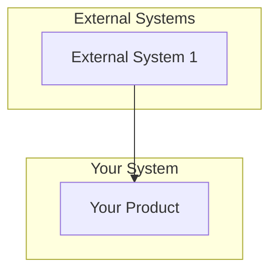
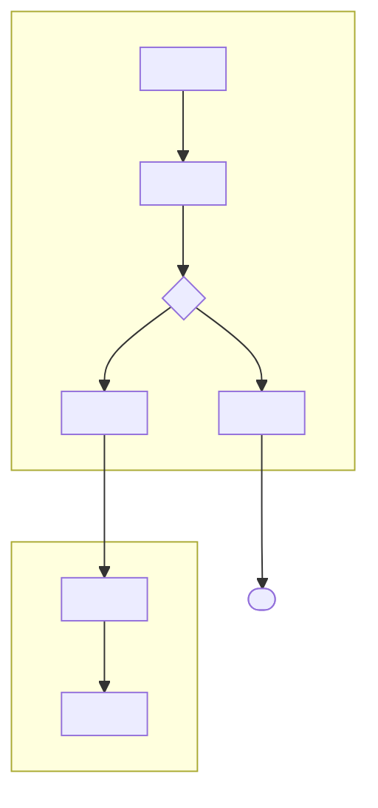
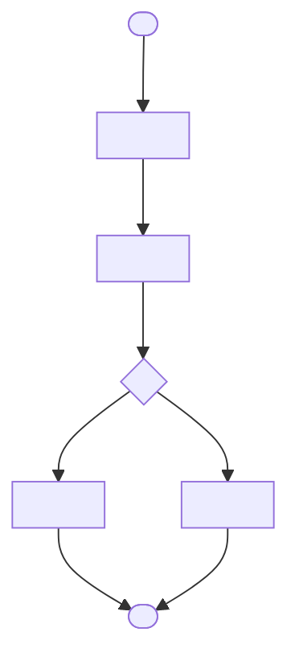
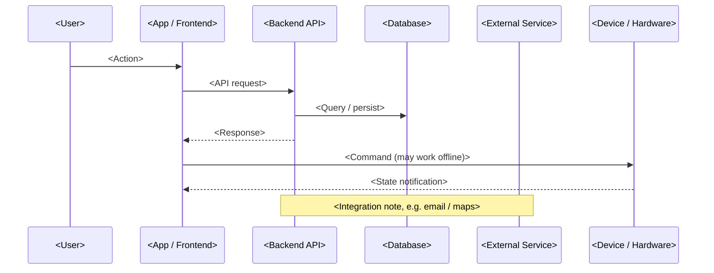

## 2. Overall Description

> This section presents a high-level overview of the product and the environment in which it will be used, the anticipated users, and known constraints, assumptions, and dependencies.

### 2.1 Product Perspective

> Describe the product's context and origin. If this SRS defines a component of a larger system, state how this software relates to the overall system and identify major interfaces.

**Product Context:**
> Describe whether this is a new product, replacement, upgrade, or component of a larger system.

**System Relationships:**
> If part of a larger system, describe relationships and interfaces.

**Context Diagram:**
> Optionally include a context diagram.

### 2.2 User Classes and Characteristics

> Identify the various user classes that you anticipate will use this product and describe their pertinent characteristics.

| User Class | Description | Characteristics | Priority |
|------------|-------------|-----------------|----------|
| <User Class 1> | <Description> | <Characteristics> | Primary/Secondary |

### 2.3 Operating Environment

> Describe the environment in which the software will operate.

**Hardware Platform:**
- <Hardware requirement 1>
- <Hardware requirement 2>

**Operating Systems:**
- <OS 1> <Version>
- <OS 2> <Version>

**Software Components:**
- <Software component 1>
- <Software component 2>

### 2.4 Design and Implementation Constraints

> Describe any factors that will limit the options available to the developers.

**Technology Constraints:**
- **Programming Languages:** <Languages>
- **Databases:** <Databases>
- **Frameworks:** <Frameworks>

**Corporate/Regulatory Policies:**
- <Policy 1>
- <Policy 2>

### 2.5 Assumptions and Dependencies

> List any assumed factors that could affect the requirements stated in the SRS. Identify any dependencies the project has on external factors.

**Assumptions:**
- <Assumption 1>
- <Assumption 2>

**Dependencies:**
- <Dependency 1>
- <Dependency 2>

### 2.6 Current Business Flows (AS-IS)

> Describe how the work is performed today, before the system is introduced. Use a **flowchart** per scenario, grouping each actor's steps in a `subgraph`, and use diamonds `{...}` for decisions. The goal is to expose the pain points the new system will solve. Add one sub-section (2.6.1, 2.6.2, …) per scenario.

#### 2.6.1 <AS-IS Scenario Name>

> **Key observation:** <Describe the limitation / pain point this AS-IS flow reveals.>

### 2.7 New Business Flows (TO-BE)

> Describe how the work will be performed with the new system. Use one **flowchart** per business process for end-to-end and per-task flows. Add a **sequence diagram** when an architecture/integration concept (app ↔ backend ↔ external services ↔ device) needs to be shown. Add one sub-section (2.7.1, 2.7.2, …) per process.

#### 2.7.1 <TO-BE Process Name>

#### 2.7.x Architecture / Integration Concept (Optional)

> Use a sequence diagram to show how the components interact at a conceptual level.

