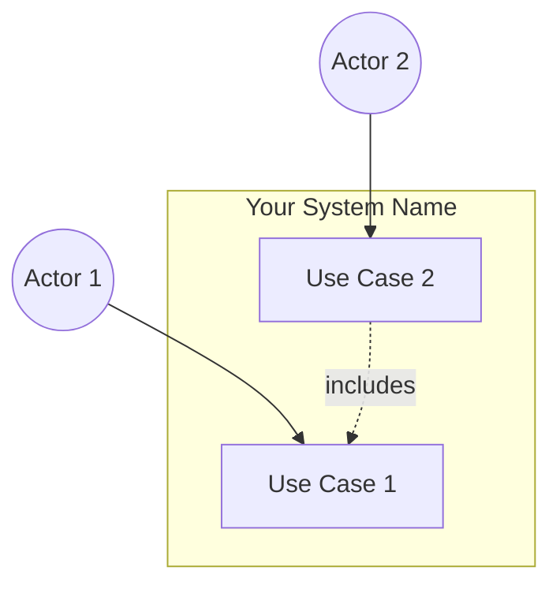
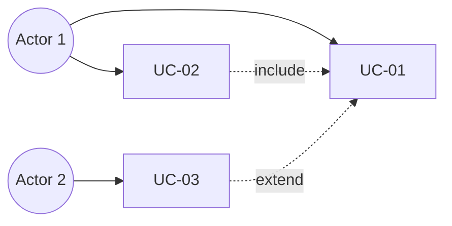

## 3. Use Cases

> This section documents how users interact with the system to achieve specific goals. Use cases provide detailed interaction flows that guide implementation and testing, bridging high-level user needs and detailed system requirements.
>
> **Structure:** Split into **two parts**: (1) this index file — diagrams and list with links; (2) **one file per use case** in `use-cases/` (e.g. `use-cases/uc-01-<name>.md`). Generate each use case detail from the **use-case-detail template** (`3-use-case-detail-template.md`).

### 3.1 Use Case Diagrams

> Provide visual representations of actors, use cases, and their relationships using UML use case diagrams. Use Mermaid diagrams or equivalent notation. Include system boundary, actors (stick figures or actor notation), use cases (ovals), and relationships (associations, includes, extends).

**System Context Diagram:**
> Provide visual representations of actors, use cases, and their relationships using UML use case diagrams. Use Mermaid diagrams or equivalent notation.

**Per-Module Use Case Diagrams:**
> When the system has many use cases, draw one diagram per module/group instead of a single large diagram. Actors are circles `((...))`, use cases are boxes, and `include`/`extend` relationships are dotted arrows. Repeat this block for each module (3.1.1, 3.1.2, …).

---

### 3.2 List Use Case

> Provide a comprehensive list of all use cases in the system. Each use case must link to its **detailed specification document** in `use-cases/` (one file per use case, created using `3-use-case-detail-template.md`).

| Use Case ID | Use Case Name | Actor(s) | Priority | Status | Link to Detail |
|-------------|---------------|----------|----------|--------|----------------|
| UC-01 | <Use Case Name> | <Actor> | High/Medium/Low | Draft/Approved | [UC-01 Detail](use-cases/uc-01-<use-case-name>.md) |
| UC-02 | <Use Case Name> | <Actor> | High/Medium/Low | Draft/Approved | [UC-02 Detail](use-cases/uc-02-<use-case-name>.md) |
| UC-03 | <Use Case Name> | <Actor> | High/Medium/Low | Draft/Approved | [UC-03 Detail](use-cases/uc-03-<use-case-name>.md) |

**Use Case Relationships:**
> Document relationships between use cases (includes, extends, generalizes).

| Use Case | Relationship Type | Related Use Case | Description |
|----------|-------------------|-----------------|-------------|
| UC-02 | includes | UC-01 | <Description> |

