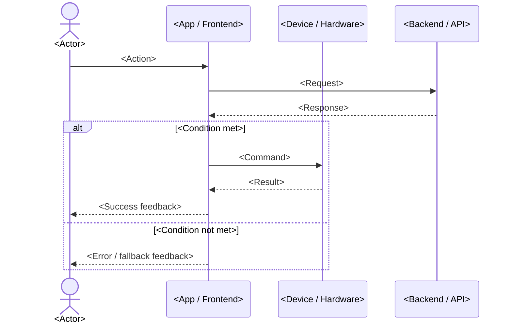

## F-XX <System Feature Name>

> Replace "F-XX" and "<System Feature Name>" with the actual feature ID and name.

### F-XX.1 Description

> Provide a short description of the feature and indicate whether it is of High, Medium, or Low priority.

**Feature Name:** <System Feature Name>

**Priority:** High / Medium / Low

**Brief Description:**
> Provide a concise description of what this feature does and why it's needed.

**User Story (Optional - Agile format):**
> Use this format for Agile projects or when you want to express requirements from a user perspective.

**As a** <user role>, **I want to** <action/functionality> **so that** <benefit/value>.

*Example: As a Sales Representative, I want to create a new order so that I can record transactions with customers.*

**Feature Scope:**
**In Scope:**
- <Scope item 1>
- <Scope item 2>

**Out of Scope:**
- <Out of scope item 1>

**Related Use Cases:**
- UC-XX: <Use Case Name>
- UC-YY: <Use Case Name>

---

### F-XX.2 Stimulus/Response Sequences

> List the sequences of user actions and system responses that stimulate the behavior defined for this feature.

**Sequence 1: <Primary User Action>**

| Step | Actor/Action | System Response |
|------|--------------|-----------------|
| 1 | <Actor> <action> | <System> <response> |
| 2 | <Actor> <action> | <System> <response> |
| 3 | <System> <response> | <Use case ends> |

**Error Handling:**

| Step | Actor/Action | System Response | Error Condition |
|------|--------------|-----------------|------------------|
| 1 | <Actor> <action> | <System> <response> | <Error condition> |
| 2 | <System> <detects error> | <System> <error handling> | |

---

### F-XX.3 Functional Requirements

> Itemize the specific functional requirements associated with this feature. Use "TBD" as a placeholder when necessary information is not yet available.

| Req ID | Requirement Description | Priority | Status |
|--------|------------------------|----------|--------|
| FR-XX-01 | <Functional requirement description> | High/Medium/Low | Draft/Approved |
| FR-XX-02 | <Functional requirement description> | High/Medium/Low | Draft/Approved |

**FR-XX-01: <Requirement Name>**

**User Story (if applicable):**
> *As a <user role>, I want to <action> so that <benefit>.*

**Description:**
> Elaborate on what the system must do.

**Acceptance Criteria:**
- <Criterion 1>
- <Criterion 2>

**Error Handling:**
- <Error condition 1>: <Handling approach>
- <Error condition 2>: <Handling approach>

---

**Data Requirements:**

**Input Data:**
| Data Element | Type | Required | Validation Rules |
|--------------|------|----------|------------------|
| <Field Name> | <Type> | Yes/No | <Validation rules> |

**Output Data:**
| Data Element | Type | Description |
|--------------|------|-------------|
| <Field Name> | <Type> | <Description> |

---

**User Interface Requirements:**

**Screens/Pages:**
- <Screen 1>: <Description>
- <Screen 2>: <Description>

**Key UI Elements:**
- <UI element 1>
- <UI element 2>

**UI Reference:** <Link to wireframe or mockup>

---

**Dependencies:**

**Internal Dependencies:**
- Feature F-YY: <Dependency description>

**External Dependencies:**
- <External system/component>: <Dependency description>

---

**Assumptions:**
- <Assumption 1>
- <Assumption 2>

---

### F-XX.4 Diagram

> Provide at least one diagram that illustrates the feature's behavior. A **sequence diagram** is the default for showing the interaction between the actor, the app, the device, and backend services. Use a **flowchart** instead (or in addition) when the feature is mainly decision/branch logic, or a **stateDiagram-v2** when the feature is about state transitions.

