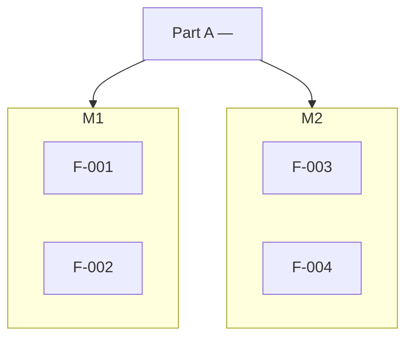

## 4 System Features

### 4.1 List of System Features

> Provide a comprehensive list of all system features in the system.

| System Feature ID | System Feature Name | Actor(s) | Priority | Status | Link to Detail |
|-------------------|---------------------|----------|----------|--------|----------------|
| F-01 | <System Feature Name> | <Actor> | High/Medium/Low | Draft/Approved | [F-01 Detail]() |
| F-02 | <System Feature Name> | <Actor> | High/Medium/Low | Draft/Approved | [F-02 Detail]() |

---

### 4.2 Feature Map

> Provide a visual map that groups system features into modules / parts (e.g. mobile app, admin system, backend). Use one diagram per part when the feature set is large. This helps readers see how features cluster and relate.

**Part A — <e.g. Mobile App Features>:**

> Repeat with additional diagrams (Part B — admin system, Part C — backend, etc.) as needed.
