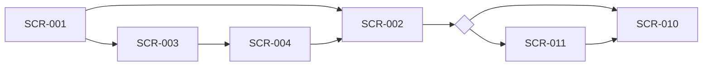

## 6. External Interface Requirements

> This section provides information to ensure that the system will communicate properly with users and with external hardware or software elements.

### 6.1 User Interfaces

> Describe the logical characteristics of each interface between the software product and the users.

**UI Standards:**
- <UI standard 1>
- <UI standard 2>

**Standard UI Elements:**
- <UI element 1>
- <UI element 2>

**Error Message Standards:**
- <Standard 1>
- <Standard 2>

**UI Specification Reference:**
> Reference separate UI specification document if available.
- <UI specification document>

#### 6.1.1 Screen Transition Diagrams

> Show how the user navigates between screens. Use a `graph LR`/`graph TB` with screen IDs as nodes, edges labelled with the triggering action/condition, and diamonds `{...}` for branch points (e.g. role or state-based routing). Split into multiple diagrams (6.1.1.1, 6.1.1.2, …) by flow — authentication, main tabs, settings, etc.

##### 6.1.1.1 <Flow Name, e.g. Authentication → Home>

> Repeat for each navigation flow (main tabs, settings, role-specific screens, notifications, …).

### 6.2 Software Interfaces

> Describe the connections between this product and other software components.

| Component Name | Version | Purpose | Interface Type |
|----------------|---------|---------|---------------|
| <Component 1> | <Version> | <Purpose> | <Type> |

**Interface Details:**
- **Protocol:** <Protocol>
- **Data Format:** <Data format>
- **Service Level:** <Response time, frequency>
- **Security:** <Security requirements>

### 6.3 Hardware Interfaces

> Describe the characteristics of each interface between the software and hardware (if any) components of the system.

| Hardware Component | Description | Interface Type | Protocol |
|-------------------|-------------|----------------|----------|
| <Component 1> | <Description> | <Type> | <Protocol> |

### 6.4 Communications Interfaces

> State the requirements for any communication functions the product will use.

**Communication Functions:**
- **Email:** <Requirements>
- **Web Browser:** <Supported browsers>
- **Network Protocols:** <Protocols>
- **Security:** <Security requirements>

